# Práctica GitHub {#sec-github}

## Objetivos

En esta primera práctica no escribiremos ni una línea de código en R. Antes de manipular datos biomédicos necesitamos una herramienta que garantice que ese trabajo sea **reproducible** y **recuperable**: un sistema de control de versiones. Trabajaremos con `Git` desde la línea de comandos, incluso sin necesidad de estar conectados a un repositorio remoto como GitHub, para entender su lógica interna antes de automatizarla desde RStudio.

Al finalizar esta práctica seréis capaces de:

- Diferenciar un directorio de trabajo ordinario de un **repositorio** vigilado por Git.
- Registrar el histórico de cambios de un proyecto mediante *commits*.
- Recuperar archivos borrados, tanto si el borrado fue registrado (*committed*) como si no.
- Interpretar la salida de `git status` y `git log`, las dos órdenes que más se ejecutan en el día a día.

## ¿Por qué control de versiones en ciencia de datos?

Un análisis de datos biomédicos rara vez se escribe de una sola vez: se corrige un filtro, se añade una variable, se cambia el criterio de exclusión de pacientes, etc. Sin un sistema de control de versiones, ese historial de decisiones se pierde o queda disperso en archivos con nombres como `analisis_final_v2_definitivo.R`. Git resuelve este problema guardando, de forma eficiente, el estado completo de un proyecto en cada punto en el que decidimos "fijarlo" (un *commit*), permitiendo:

- **Reproducibilidad**: cualquier resultado puede vincularse al identificador exacto del código que lo generó.
- **Reversibilidad**: un error de ayer no destruye el trabajo de hoy; siempre se puede volver a un estado anterior.
- **Colaboración**: varias personas pueden trabajar sobre el mismo proyecto sin sobrescribirse (aspecto que veremos con más detalle al usar repositorios remotos en GitHub, en el @sec-seminario).

A nivel conceptual, Git no almacena una lista de diferencias entre versiones (como hacían sistemas más antiguos), sino una serie de "fotografías" (*snapshots*) del proyecto completo; cada *commit* apunta a la fotografía anterior, formando una cadena histórica [@chacon2014progit]. Esta práctica se limita al uso **local** de Git; la integración con GitHub y RStudio se retoma en el @sec-seminario.

## Preparación del directorio de trabajo

Para este ejercicio necesitaréis únicamente dos archivos: `Analysis.R` y `Datos.txt`. Cread una carpeta de trabajo que contenga solo estos dos archivos: ningún otro fichero, ni siquiera oculto, debe interferir con el ejercicio.

A continuación abriremos la línea de comandos del sistema operativo (la **terminal**). En Linux, la terminal luce como en la @fig-terminal-linux.

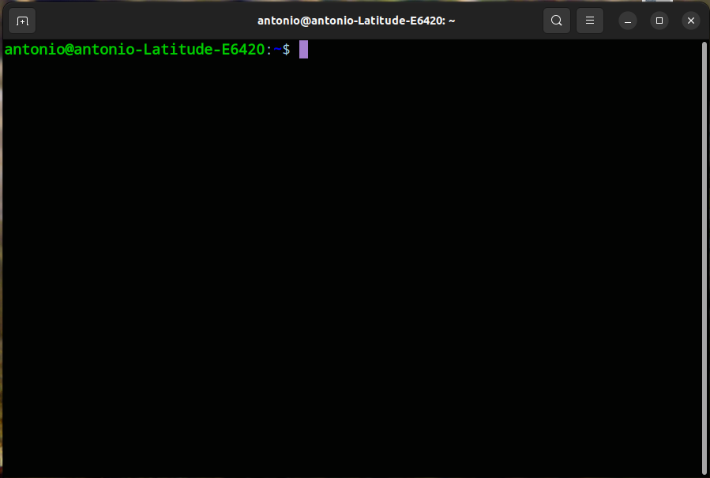{#fig-terminal-linux width="90%"}

El directorio en el que "escucha" la terminal al abrirse no tiene por qué coincidir con el directorio donde guardasteis los archivos. Para saber en qué carpeta está situada la terminal en cada momento, existen dos comandos equivalentes:

- `pwd` (*print working directory*): en Linux y macOS.
- `cd` (sin argumentos): en Windows, muestra el directorio actual.

El resultado es similar al de la @fig-pwd.

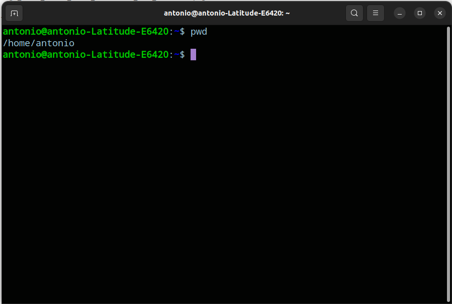{#fig-pwd width="90%"}

Para desplazarnos hasta la carpeta que contiene `Analysis.R` y `Datos.txt` disponemos de dos estrategias:

1. **Abrir la terminal directamente desde la carpeta**:
   - En *Linux*, desde el explorador de archivos, botón derecho sobre la carpeta → "abrir en la terminal".
   - En *Windows*, botón derecho sobre la carpeta → "abrir ventana de comandos aquí" (o *Git Bash here*, si tenéis instalado Git para Windows).
   - En *macOS*, la opción más directa es arrastrar la carpeta sobre el icono de la Terminal, lo que completa la ruta automáticamente.

2. **Navegar con `cd` (change directory)** desde una terminal ya abierta. Es la aproximación que seguiremos en el curso, porque el comando es idéntico en los tres sistemas operativos, aunque la ruta concreta dependa de dónde guarde cada estudiante sus archivos:

```{.bash filename="terminal"}
cd Desktop/Practica_github/
```

Para confirmar que estamos en el lugar correcto, repetimos `pwd`/`cd` o listamos el contenido de la carpeta:

```{.bash filename="terminal"}
ls -l   # Linux / macOS
dir     # Windows
```

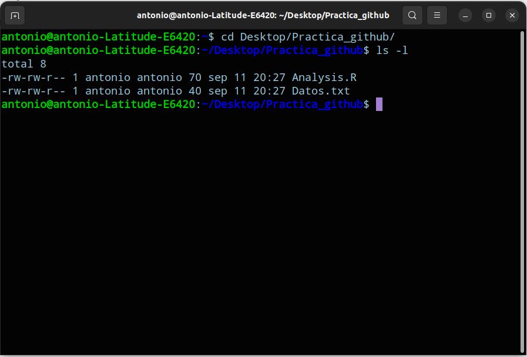{#fig-ls-l width="90%"}

Con los archivos correctos delante, pasamos a los comandos básicos de Git.

## Comandos básicos de Git

### Inicializar un repositorio

Si la carpeta actual no está vigilada por Git, debemos indicárselo explícitamente: esto es **inicializar** un repositorio.

```{.bash filename="terminal"}
git init
```

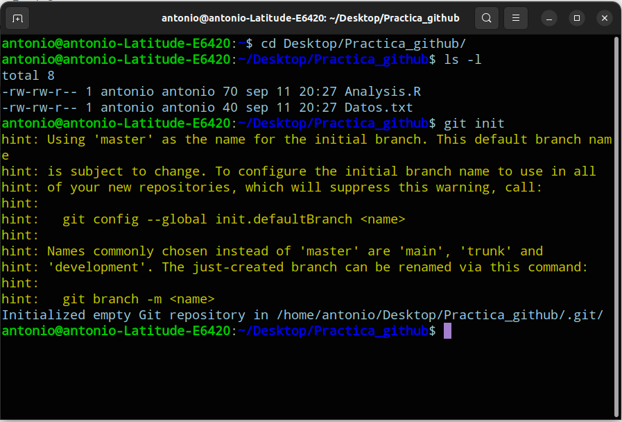{#fig-git-init width="90%"}

Este comando crea una subcarpeta oculta `.git/` que almacena todo el historial y la configuración del repositorio. Borrar esa carpeta (algo que nunca deberíamos hacer sin querer) equivale a perder todo el historial de versiones, aunque los archivos de trabajo actuales permanezcan intactos.

#### Verificar el estado del repositorio

El comando que más se ejecuta en el flujo de trabajo con Git es, con diferencia, `git status`:

```{.bash filename="terminal"}
git status
```

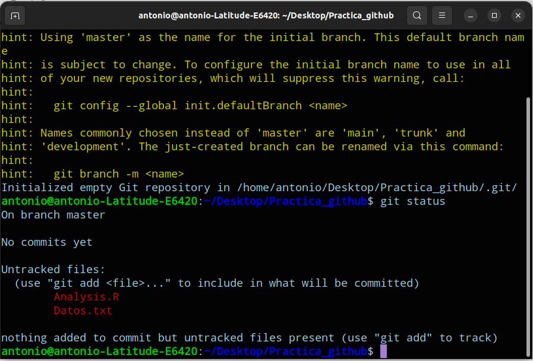{#fig-git-status width="90%"}

`git status` nos informa de tres posibles estados por archivo: sin rastrear (*untracked*), modificado y no preparado (*not staged*), o preparado para el próximo *commit* (*staged*). En la @fig-git-status vemos que los archivos aparecen como *untracked*: existen en la carpeta, pero Git aún no los vigila.

#### Rastreo de archivos

Para incorporar archivos al área de *staging* usamos `git add <archivo>`. Como acordamos vigilar **todo** el directorio, sustituimos el nombre de cada archivo por el comodín `.` (punto), que significa *todos los archivos del directorio actual*:

```{.bash filename="terminal"}
git add .
```

Si repetimos `git status`, los archivos ya no aparecen como *untracked*, sino listos para el próximo *commit* (@fig-git-add-status).

{#fig-git-add-status width="90%"}

#### Registro de cambios: los *commits*

Rastrear un archivo (`git add`) no equivale a fijar su estado en el historial. Para ello necesitamos crear un **commit**, que es un punto de guardado permanente identificado por un mensaje descriptivo:

```{.bash filename="terminal"}
git commit -m "inicio del proyecto"
```

{#fig-git-commit width="90%"}

Si volvemos a preguntar por el estado del repositorio...

{#fig-git-commit-status width="90%"}

...obtenemos el mensaje que **siempre queremos ver**:

```
On branch master
nothing to commit, working tree clean
```

Este mensaje confirma que el estado actual de los archivos coincide exactamente con el último *commit* registrado: no hay cambios pendientes de rastrear ni de confirmar.

## Modificación de ficheros

### Modificar archivos existentes

Abrimos `Analysis.R` y añadimos un comentario en la primera línea, pasando del script original (@fig-analysis-old) al modificado (@fig-analysis-new).

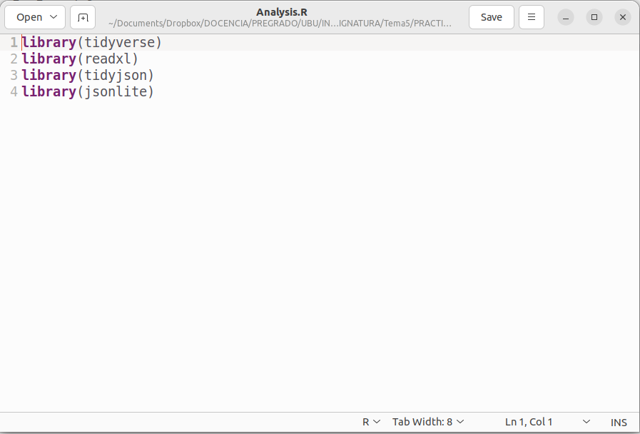{#fig-analysis-old width="90%"}

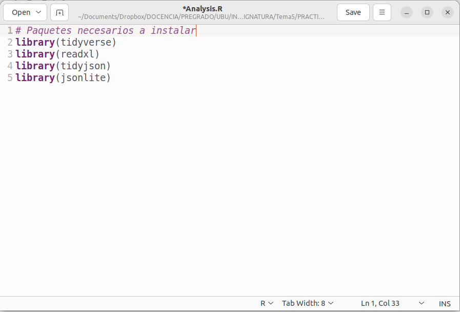{#fig-analysis-new width="90%"}

Al ejecutar de nuevo `git status`, Git detecta el cambio y nos indica los pasos a seguir (@fig-git-modify-status):

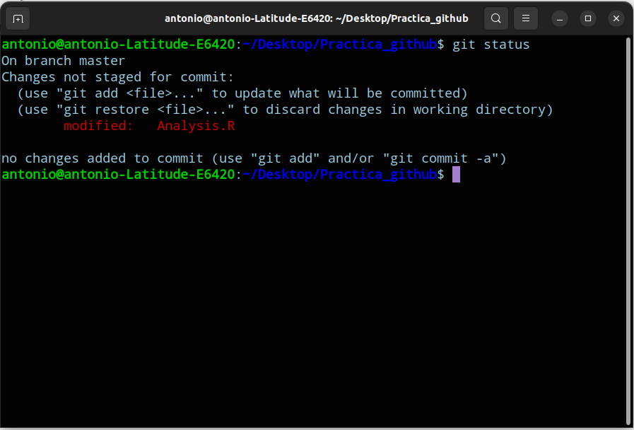{#fig-git-modify-status width="90%"}

Como en el paso anterior, rastreamos el cambio y lo registramos con un nuevo *commit*:

```{.bash filename="terminal"}
git add .
git commit -m "nuevo comentario en Analysis.R"
```

{#fig-git-add-commit width="90%"}

### Borrar archivos y recuperarlos

Accidentalmente borrar un archivo es uno de los errores más comunes en cualquier proyecto. Gracias a Git podemos "volver sobre nuestros pasos", pero **el procedimiento de recuperación depende de si el borrado llegó a registrarse en un *commit***.

#### Borrado sin *commit*

Este es el caso más sencillo: como el borrado aún no se ha confirmado, basta con un equivalente a "deshacer" (*undo*). En Git, ese mecanismo es `git stash`, que guarda temporalmente los cambios no confirmados y restaura el último estado registrado.

Listamos el contenido de la carpeta:

```{.bash filename="terminal"}
ls -l    # dir en Windows
```

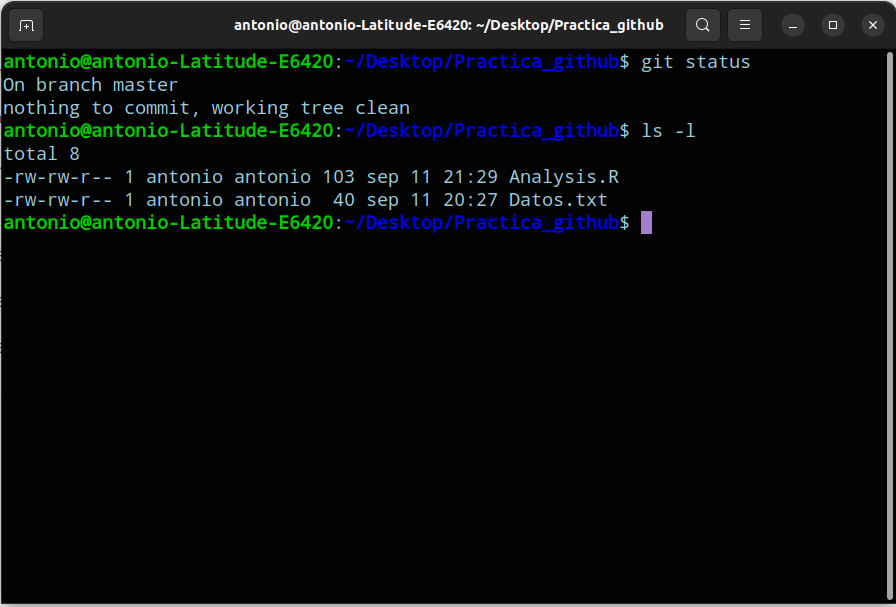{#fig-ls-stash-pre width="90%"}

Borramos `Analysis.R` (`rm` en Linux/macOS, `del` en Windows) y comprobamos que ha desaparecido:

```{.bash filename="terminal"}
rm Analysis.R    # del "Analysis.R" en Windows
ls -l
```

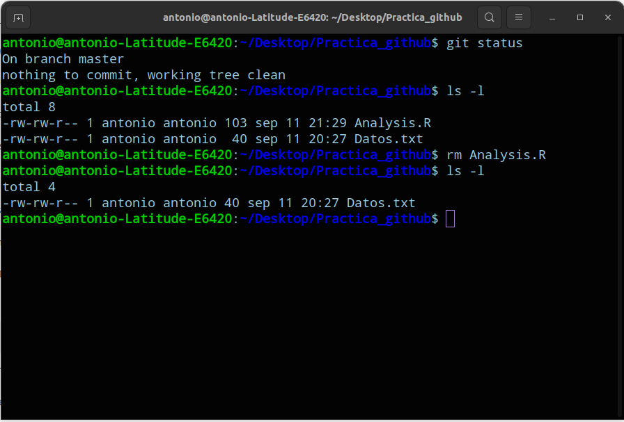{#fig-ls-stash-after width="90%"}

Como este cambio **no está confirmado**, `git stash` es suficiente para recuperar el archivo:

```{.bash filename="terminal"}
git stash
```

{#fig-ls-after-stash width="90%"}

#### Borrado con *commit*

Esta situación es algo más compleja, pero también más habitual: el borrado se registra en el historial, por lo que `git stash` deja de ser una opción válida.

```{.bash filename="terminal"}
rm Analysis.R
ls -l          # dir en Windows
git status
```

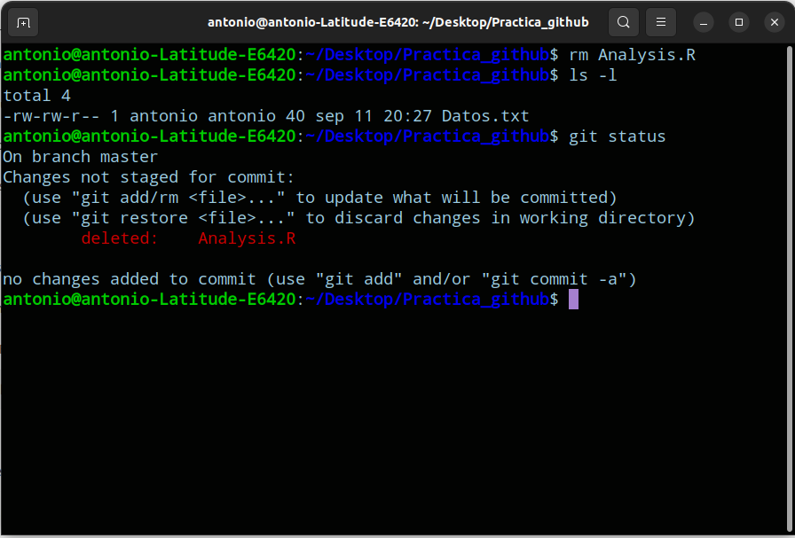{#fig-rm-status-pre width="90%"}

Rastreamos y confirmamos el borrado como cualquier otro cambio:

```{.bash filename="terminal"}
git add .
git commit -m "Removed Analysis.R"
git status
```

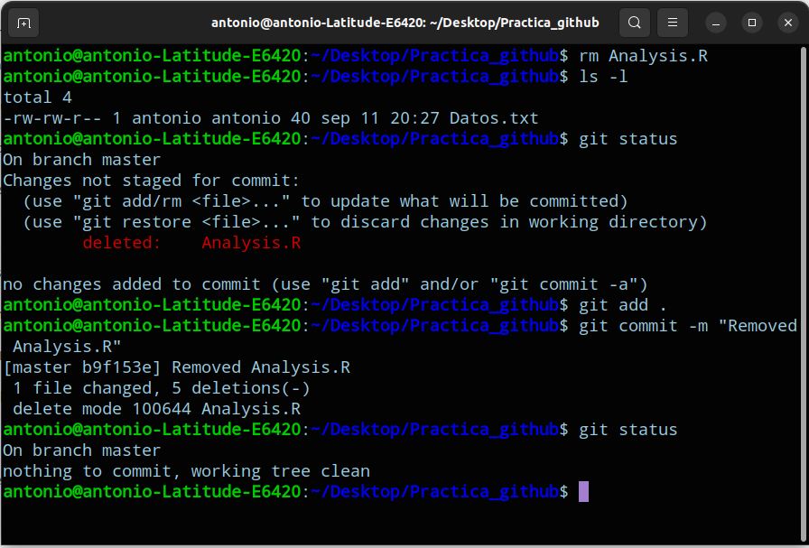{#fig-rm-status-post width="90%"}

El archivo `Analysis.R` ya no está presente y, además, su ausencia ha sido **rastreada** y **confirmada**: `git stash` ya no sirve de nada en este punto. Sin embargo, precisamente por haber quedado registrado en el historial, sí podemos recuperarlo revirtiendo el *commit* que lo eliminó.

##### Consultar el historial: `git log`

Para localizar el *commit* que eliminó el archivo consultamos el historial completo del repositorio:

```{.bash filename="terminal"}
git log
```

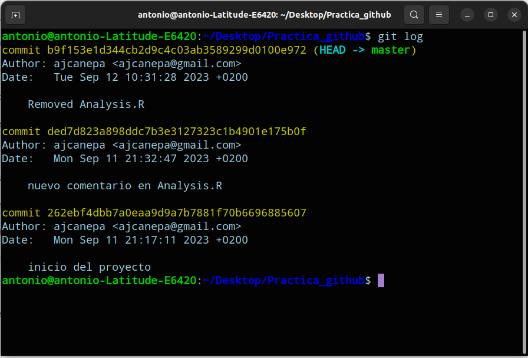{#fig-git-log width="90%"}

En este historial, los cambios más recientes aparecen primero (más cerca de la línea de comandos). Cada entrada muestra el **identificador único del commit** (*Commit Unique Identifier*, CUI): un código alfanumérico de 40 caracteres (un *hash* SHA-1) situado justo a la derecha de la palabra `commit`. En nuestro ejemplo, el *commit* que eliminó el archivo tiene el siguiente CUI:

- **CUI**: `b9f153e1d344cb2d9c4c03ab3589299d0100e972`

##### Revertir un *commit*

Para deshacer los efectos de un *commit* concreto sin reescribir el historial (una operación segura incluso en repositorios compartidos) usamos `git revert <CUI>`. Basta con los primeros dígitos del identificador para que Git lo reconozca sin ambigüedad:

```{.bash filename="terminal"}
git revert b9f153e1d344cb2d9c4c03ab3589299d0100e972
```

Al ejecutar `git revert`, Git abre un editor de texto (por defecto, `vim`) para que redactemos el mensaje del nuevo *commit* que anula al anterior.

{#fig-revert-pre width="90%"}

Redactamos el mensaje (parte del texto ya viene generado automáticamente por Git):

{#fig-revert-edit width="90%"}

En Linux/macOS, con `vim` abierto, `^` equivale a `Ctrl` (`Cmd` en Mac). Para guardar y salir pulsamos `Ctrl + X` (según la versión de `vim`, puede requerir antes `Esc` seguido de `:wq`):

{#fig-revert-post width="90%"}

::: {.callout-note}
## Particularidad en Windows

En Windows, el editor `vim` no muestra las combinaciones `^G`/`^X` en la parte inferior. Para escribir, pulsad primero la tecla `i` (modo inserción; deja de verse el texto `-INSERT-` cuando termináis). Para salir y guardar, pulsad `Esc` y a continuación escribid:

```{.bash filename="vim"}
:wq
```

seguido de `Enter`.
:::

Por último, comprobamos que el archivo ha vuelto y que el árbol de trabajo está limpio:

```{.bash filename="terminal"}
ls -l
git status
```

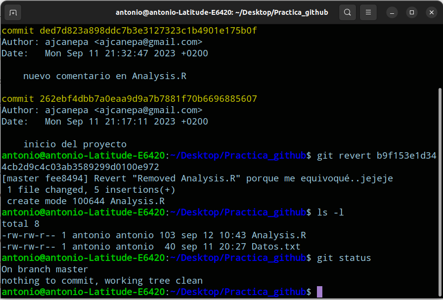{#fig-git-final width="90%"}

## Resumen de comandos

La @tbl-git-comandos recoge los comandos de Git utilizados en esta práctica, que forman el núcleo mínimo necesario para trabajar de forma reproducible durante el resto del curso.

| Comando | Efecto |
|---|---|
| `git init` | Inicializa un repositorio en la carpeta actual |
| `git status` | Muestra el estado de los archivos (*untracked* / *staged* / limpio) |
| `git add <archivo>` / `git add .` | Rastrea un archivo (o todos) para el próximo *commit* |
| `git commit -m "mensaje"` | Registra permanentemente el estado rastreado |
| `git stash` | Restaura el último estado confirmado (solo cambios sin *commit*) |
| `git log` | Muestra el historial de *commits* y sus identificadores (CUI) |
| `git revert <CUI>` | Crea un nuevo *commit* que deshace los efectos de otro anterior |

: Comandos básicos de Git utilizados en esta práctica. {#tbl-git-comandos}

Estos comandos son la base sobre la que trabajaremos en el @sec-seminario, donde conectaremos un repositorio local con GitHub para publicar y compartir el trabajo del seminario evaluable del curso.

## Licencia

Autor: Antonio Canepa Oneto\
Área: Lenguajes y Sistemas Informáticos\
Departamento: Ingeniería Informática\
Escuela Politécnica Superior, Universidad de Burgos

{width="15%"}

Esta obra está bajo una licencia Creative Commons *Reconocimiento-NoComercial-CompartirIgual 3.0 Unported*. No se permite un uso comercial de esta obra ni de las posibles obras derivadas; la distribución de las mismas debe hacerse con una licencia igual a la que regula esta obra original. Licencia disponible en [creativecommons.org/licenses/by-nc-sa/3.0](http://creativecommons.org/licenses/by-nc-sa/3.0/).
