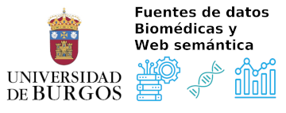

# Prefacio {.unnumbered}

::: {layout="[85,15]"}
::: {}
Este libro reúne el cuaderno de **prácticas** de la asignatura **Fuentes de Datos Biomédicos y Web Semántica** (#8235) del Grado en Ingeniería de la Salud de la Universidad de Burgos. Es el compañero práctico del libro de teoría de la asignatura: aquí el foco está en el código R, siguiendo el enfoque `tidyverse` [@wickham2019tidyverse] descrito en @wickham2023r4ds, y en cómo aplicarlo para importar, transformar, visualizar y publicar fuentes de datos biomédicas y semánticas.
:::

::: {}
{width="100%"}
:::
:::

## Estructura del libro

El libro sigue el mismo orden que las carpetas de prácticas del curso (`00_` a `08_`) y se organiza en nueve capítulos:

0. **Práctica GitHub**: control de versiones con Git desde la línea de comandos (`init`, `status`, `add`, `commit`, `stash`, `log`, `revert`) como base para el trabajo reproducible.
1. **Seminario, GitHub y RMarkdown/Quarto**: sintaxis de los documentos dinámicos (RMarkdown y Quarto), y la estructura del seminario evaluable del curso, que combina texto, código y control de versiones.
2. **Objetos en R**: los tipos de datos y estructuras fundamentales de R (vectores, factores, fechas, matrices, *data frames*, tibbles y listas), siguiendo el modelo de @wickham2019advanced.
3. **Funciones en R**: control de flujo, iteración (`for`, `while`, `apply`/`tapply`) y definición de funciones propias, con ejemplos biomédicos y de bioinformática.
4. **Importación y exportación de datos**: lectura y escritura de datos estructurados (`.xlsx`, `.csv`) y semiestructurados (**JSON**, XML), con especial atención al trabajo con **JSON** mediante `jsonlite` y `tidyjson`.
5. **Procesamiento y manejo de datos**: manipulación de tablas con `dplyr` y `tidyr` (filtrado, resumen, *pivoting*, combinación de tablas) [@rpkg-dplyr; @rpkg-tidyr].
6. **Visualización de la información**: la gramática de gráficos de `ggplot2` [@wickham2016ggplot2book] aplicada a datos biomédicos y ambientales.
7. **Consultas RDF y SPARQL**: representación de datos como tripletas sujeto-predicado-objeto, el paquete `rdflib` y consultas SPARQL a *endpoints* como DBpedia y Wikidata.
8. **Prácticas PubMed**: consulta programática de PubMed con `pubmedR`, análisis bibliométrico con `bibliometrix`, nubes de palabras y gestión de bibliografía en RMarkdown/Quarto.

## Cómo usar este libro

Cada capítulo mezcla teoría breve con fragmentos de código en R que ilustran los conceptos presentados. El código se muestra con fines didácticos y **no se ejecuta** al generar este PDF: muchos ejemplos dependen de datos propios de cada estudiante, de servicios web en vivo o de claves de API personales, por lo que se recomienda ejecutar el código directamente en RStudio, siguiendo el propio material del curso disponible en el repositorio del curso.

Al inicio de cada capítulo se indican los paquetes de R necesarios. La instalación conjunta de todos los paquetes del curso puede hacerse ejecutando el script `Instalar_Paquetes_Curso_8235.R` disponible en la raíz del repositorio de prácticas.

## Licencia

Autor: Antonio Canepa Oneto\
Área: Lenguajes y Sistemas Informáticos\
Departamento: Ingeniería Informática\
Escuela Politécnica Superior, Universidad de Burgos

{width="15%"}

Esta obra está bajo una licencia Creative Commons *Reconocimiento-NoComercial-CompartirIgual 3.0 Unported*. No se permite un uso comercial de esta obra ni de las posibles obras derivadas; la distribución de las mismas debe hacerse con una licencia igual a la que regula esta obra original. Licencia disponible en [creativecommons.org/licenses/by-nc-sa/3.0](http://creativecommons.org/licenses/by-nc-sa/3.0/).
